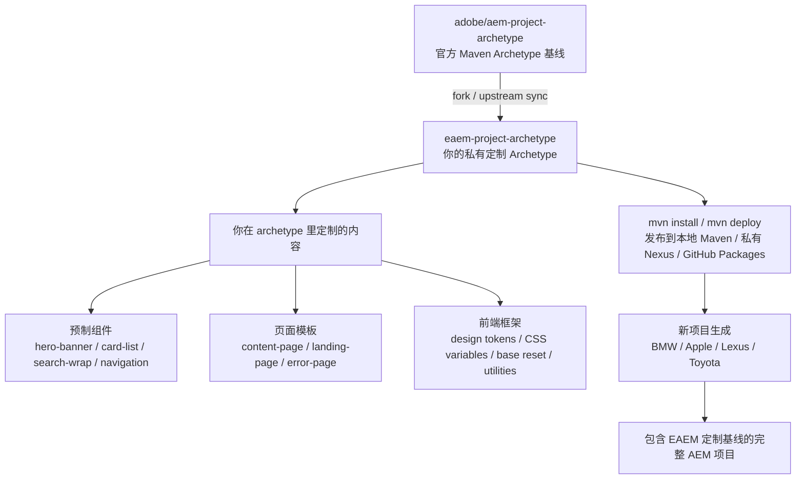

# EAEM Project Archetype Guide

这个仓库是从 `adobe/aem-project-archetype` fork 出来的私有 AEM 项目脚手架。目标是把常用的 AEM Cloud Service 项目结构、前端框架、组件、页面模板、策略、Dispatcher 基线和开发规范沉淀成一个 Maven Archetype，以后遇到 BMW、Apple 这类新客户时，可以一条命令生成统一质量的新项目。

## 架构关系



## 本地安装 Archetype

先在这个仓库里安装到本地 Maven 仓库：

```bash
cd /Volumes/PSSD/project/eaem-project-archetype
mvn -DskipTests install
```

EAEM 默认只跑 `basic` archetype integration test。Adobe upstream 的 Angular/React IT 会安装老版本 Node/npm 依赖，在现代 macOS/Python 或外置盘空间不足时容易失败。需要全量验证时再显式执行：

```bash
mvn -P it-all install
```

之后就可以生成客户项目：

```bash
mvn -B org.apache.maven.plugins:maven-archetype-plugin:3.3.1:generate \
  -DarchetypeGroupId=com.merkle.aem \
  -DarchetypeArtifactId=eaem-project-archetype \
  -DarchetypeVersion=1.0.0-SNAPSHOT \
  -DappTitle="BMW AEM" \
  -DappId="bmw" \
  -DgroupId="com.bmw" \
  -DartifactId="bmw-aem" \
  -Dpackage="com.bmw" \
  -Dversion="0.0.1-SNAPSHOT" \
  -DaemVersion="cloud" \
  -DfrontendModule="general"
```

也可以用仓库里的辅助脚本：

```bash
/Volumes/PSSD/project/eaem-project-archetype/bin/generate-client-project.sh BMW /Users/ethan/work
```

## 你应该在哪里开发定制内容

### 组件

默认组件放这里：

```text
src/main/archetype/ui.apps/src/main/content/jcr_root/apps/__appId__/components
```

适合沉淀每个新项目都要带上的组件，例如：

- `hero-banner`
- `card-list`
- `search-wrap`
- `breadcrumb`
- `navigation`
- `form-container`

如果组件需要 Sling Model，对应 Java 放这里：

```text
src/main/archetype/core/src/main/java
src/main/archetype/core/src/test/java
```

### 前端框架

普通 Sites 前端默认改这里：

```text
src/main/archetype/ui.frontend.general
```

重点文件：

```text
src/main/archetype/ui.frontend.general/src/main/webpack/site/_variables.scss
src/main/archetype/ui.frontend.general/src/main/webpack/site/_base.scss
src/main/archetype/ui.frontend.general/src/main/webpack/site/main.scss
src/main/archetype/ui.frontend.general/src/main/webpack/site/main.ts
src/main/archetype/ui.frontend.general/src/main/webpack/components
src/main/archetype/ui.frontend.general/package.json
src/main/archetype/ui.frontend.general/clientlib.config.js
```

如果你想统一 Tailwind、PostCSS、Style Dictionary、CSS variables、组件级 SCSS 或 TypeScript 初始化，都应该优先在这里做。

生成到 AEM 的 clientlibs 在这里：

```text
src/main/archetype/ui.apps/src/main/content/jcr_root/apps/__appId__/clientlibs
```

### 页面模板和策略

Editable Templates、Template Types、Policies 放这里：

```text
src/main/archetype/ui.content/src/main/content/jcr_root/conf/__appId__/settings/wcm/template-types
src/main/archetype/ui.content/src/main/content/jcr_root/conf/__appId__/settings/wcm/templates
src/main/archetype/ui.content/src/main/content/jcr_root/conf/__appId__/settings/wcm/policies
```

建议你把常用模板沉淀成：

- `content-page`
- `landing-page`
- `home-page`
- `error-page`
- `campaign-page`

策略里维护 allowed components、style system、默认 responsive grid、默认 component policies。

### 初始内容和站点结构

站点初始内容放这里：

```text
src/main/archetype/ui.content/src/main/content/jcr_root/content/__appId__
```

适合放首页、语言根、示例页面、错误页、默认 Experience Fragment 引用等。

### OSGi 配置

AEM Cloud Service OSGi 配置放这里：

```text
src/main/archetype/ui.config/src/main/content/jcr_root/apps/__appId__/osgiconfig
```

这里适合维护默认 servlet、scheduler、service user mapping、feature flag、第三方接口配置占位。

### Dispatcher

Cloud Service Dispatcher 基线放这里：

```text
src/main/archetype/dispatcher.cloud
```

AMS / AEM 6.5 Dispatcher 基线放这里：

```text
src/main/archetype/dispatcher.ams
```

现代项目默认优先维护 `dispatcher.cloud`。

### Archetype 参数和生成逻辑

新增或调整生成参数：

```text
src/main/resources/META-INF/maven/archetype-metadata.xml
```

生成后清理、按参数选择模块、重命名或删除文件：

```text
src/main/resources/META-INF/archetype-post-generate.groovy
```

Dispatcher 打包前转换逻辑：

```text
src/main/resources/META-INF/archetype-pre-package.groovy
```

## 推荐迭代路线

1. 先保留 Adobe 官方结构，完成私有坐标和本地安装。
2. 添加 EAEM 默认组件库：`hero-banner`、`card-list`、`search-wrap`、`site-header`、`site-footer`。
3. 制定前端 token：颜色、字体、间距、断点、按钮、表单、grid。
4. 收敛模板和策略：只保留真正常用的页面模板和 allowed components。
5. 增加 `AGENTS.md`、代码规范、Maven profile、静态检查、AEM Mock 单测模板。
6. 发布到私有 Maven 仓库，团队统一通过 Maven 命令生成项目。

## Upstream 同步建议

这个仓库保留 Adobe 官方远程为 `upstream`。以后同步 Adobe 更新时：

```bash
git fetch upstream
git merge upstream/develop
```
